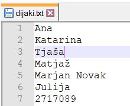

Uporaba
============

Program za generiranje nalog je sestavljen iz knjižnice nalog iz različnih področij srednješolske matematike in programa
za sestavljanje testov. Ko zaženemo program z željenimi parametri nam ustvari testov in rešitve v `LaTeX` obliki ter po želju tudi v `PDF` obliki.

********
Naloge
********
Vsebuje 60 takih nalog iz teh področij

**************
Izpis testov
**************
Za izpis testov je potrebno poklicati funkcijo ``sestavi_vse_teste`` iz programa ``generiranje.py``. Funkcija sprejme pet parametrov:

#. seznam nalog
#. ime testa
#. datoteko, ki vsebuje seznam dijakov
#. izbira združenih ali ločenih rešitev
#. izbira za avtomatično generiranje PDF datotek

in ustvari teste ter rešitve kot `LaTeX` dokumente. Po želji pa lahko avtomatično ustvari dokumente v `PDF` formatu.
`LaTeX` dokument je na voljo, zato da vedno lahko kaj naknadno spremenimo.

.. TODO: autorun požene na licu mesta conf.py in ne tm k program dejansko je, zato je treba mal okol kodo napisat (recimo datoteko za dijake kliče drugače). Ne prenese šumnikov (niti v nizu). pazi na presledek # ignore

.. .. runblock:: pycon

..    >>> import sys # ignore
..    >>> sys.path.append('../') # ignore
..    >>> from izpisi_naloge import * # ignore
..    >>> sestavi_vse_teste(naloge=[izrazi.PotencaDvoclenika(st_nalog=3), izrazi.RazstaviRazliko(min_potenca=3), naravna_stevila.DeliteljVeckratnik()], ime_testa='Izrazi in deljivost', datoteka_seznam_dijakov='../dijaki.txt', zdruzene_resitve=False)

.. code-block:: python

    >>>generiranje.sestavi_vse_teste(naloge=[izrazi.PotencaDvoclenika(st_nalog=3),
                                          izrazi.RazstaviRazliko(min_potenca=3),
                                          naravna_stevila.DeliteljVeckratnik()],
                                  ime_testa='Izrazi in deljivost', datoteka_seznam_dijakov='dijaki.txt',
                                  zdruzene_resitve=False, pdf=False)
    Test Izrazi in deljivost je sestavljen.

Program ustvari mapo z enakim imenom kot ime testa in 2 podmapi:

#. Naloge
#. Rešitve

.. figure:: slike/mape.png
    :align: center

    Ustvarjeni mapi za teste in rešitve testov

Mapa `Naloge` vsebuje posamezne zgenerirane teste, mapa `Rešitve` pa rešitve zgeneriranih testov.

Kadar mapa z enakim imenom že obstaja, nas program vpraša, če jo želimo prepisati. Če izberemo možnost `da`, se stara mapa izbriše in ustvari nova.
Če izberemo možnost `ne`, stara mapa ostane nespremenjena hkrati pa se ustvari nova mapa z enakim imenom kot ime testa in uro ustvarjanja testa.

.. code-block:: python

    >>>generiranje.sestavi_vse_teste(naloge=[izrazi.PotencaDvoclenika(st_nalog=3),
                                          izrazi.RazstaviRazliko(min_potenca=3),
                                          naravna_stevila.DeliteljVeckratnik()],
                                  ime_testa='Izrazi in deljivost', datoteka_seznam_dijakov='dijaki.txt',
                                  zdruzene_resitve=False, pdf=False)
    Mapa z imenom Izrazi in deljivost že obstaja.
    Ali jo želite prepisati z novo vsebino? [da/NE]>? ne
    Test Izrazi in deljivost-10-17-32 je sestavljen.

Seznam nalog
#############

Parameter ``naloge`` je seznam nalog iz knjižnice, ki jih želimo na posameznem testu. Na seznamu lahko podamo poljubno število nalog.

``naloge=[izrazi.PotencaDvoclenika(st_nalog=3),izrazi.RazstaviRazliko(min_potenca=3),naravna_stevila.DeliteljVeckratnik()]``

Knjižnica vsebuje naloge iz različnih področij, ki pa lahko imajo enaka imena. Zato moramo vedno nalogo klicati tako, da najprej napišemo ime poglavja in nato ime naloge. Naloge imajo različne parametre, ki so pojasnjeni v #TODOsklic točki.

``ime_poglavja.ime_naloge(parametri)``.

Primeri:

``kvadratna_funkcija.Neenacba(st_nalog=3)``

``linearna_funkcija.Neenacba()``

Ime testa
############
Parameter ``ime_testa`` je niz željenega imena testa. Izbrano ime je lahko poljubno in lahko vsebuje tudi presledke, šumnike in druge znake. Ime testa se izpiše na vrhu posameznega testa in rešitev. Enako ime ima tudi na novo ustvarjena mapa, ki vsebuje teste in rešitve.
Če imena testa ne podamo, se namesto njega izpiše današnji datum.

Primer:

``ime_testa='Izrazi in deljivost'``

.. TODO ali želim tudi tukaj ponoviti kaj se zgodi če ime že obstaja

Seznam dijakov
################
Seznam dijakov napišemo v ločeni tekstovni datoteki (`.txt`), tako da so podatki posameznega dijaka v svoji vrstici.
Podatki dijaka so lahko poljubni: ime, priimek, vpisna številka,... Namesto podatkov dijakov lahko podamo tudi naprimer imena skupin: A in B.
Podatek v posamezni vrstici predstavlja podnaslov našega testa in ime datotetke posameznega testa ali rešitve.

    Primer tekstovne datotetke

.. figure:: slike/testi.png
    :align: center

    Primer mape z generirami testi.

Če datotetka s seznamom ni podana, bo program ustvaril samo 1 test s privzetim podnaslovom `Matematika`.

Semena
********
Vrednosti v posameznih nalogah so psevdo-naključno generirana. Za seme posameznega testa je uporabljen podnaslov testa.
To nam zagotavlja, da bomo za posameznega dijaka oziroma skupino vedno dobili nalogo z enakimi podatki, ne glede na to
kolikokrat zaženemo program.
Na tak način zagotovimo, da če nam je posamezna naloga všeč, se s popravljanjem drugih ne bo spremenila.
Vendar se moramo zavedati, da na naključno generirane številke vpliva tudi vrstni red posameznih nalog.

Združene rešitve
##################
Rešitve nalog so lahko samostojna datoteka za vsakega dijaka ali pa so vse združene v eno datoteko. Privzete so združene rešitve.
Če želimo ločene moramo izbrati: ``zdruzene_resitve=False``.

PDF datoteke
#############
Testi in rešitve so `LaTeX` dokumenti, zato da imamo možnost spreminjanja in popravljanja. Ker pa za končno uporabo
potrebujemo `PDF` datoteke, nam jih lahko program avtomatično ustvari. Privzeto je ustvarjanje `PDF` datotek, vendar to
poveča časovno zahtevnost programa. Če ne želimo avtomatično generiranih `PDF` datotek, moramo klicati ``pdf=False``.

.. code-block:: python

    >>> generiranje.sestavi_vse_teste(naloge=[izrazi.PotencaDvoclenika(st_nalog=3),
    ...                                       izrazi.RazstaviRazliko(min_potenca=3),
    ...                                       naravna_stevila.DeliteljVeckratnik()],
    ...                               ime_testa='Izrazi in deljivost',
    ...                               zdruzene_resitve=True)
    This is pdfTeX, Version 3.14159265-2.6-1.40.18 (MiKTeX 2.9.6350 64-bit)
    entering extended mode
    ("Izrazi in deljivost/Naloge/Matematika.tex"
    LaTeX2e <2017-04-15>
    Babel <3.10> and hyphenation patterns for 75 language(s) loaded.
    ("C:\Program Files\MiKTeX 2.9\tex\latex\base\article.cls"
    Document Class: article 2014/09/29 v1.4h Standard LaTeX document class
    ("C:\Program Files\MiKTeX 2.9\tex\latex\base\size10.clo"))
    ("C:\Program Files\MiKTeX 2.9\tex\latex\base\inputenc.sty"
    ("C:\Program Files\MiKTeX 2.9\tex\latex\base\utf8.def"
    ("C:\Program Files\MiKTeX 2.9\tex\latex\base\t1enc.dfu")
    ("C:\Program Files\MiKTeX 2.9\tex\latex\base\ot1enc.dfu")
    ("C:\Program Files\MiKTeX 2.9\tex\latex\base\omsenc.dfu")))
    ("C:\Program Files\MiKTeX 2.9\tex\latex\pgf\frontendlayer\tikz.sty"
    ("C:\Program Files\MiKTeX 2.9\tex\latex\pgf\basiclayer\pgf.sty"
    ("C:\Program Files\MiKTeX 2.9\tex\latex\pgf\utilities\pgfrcs.sty"
    ("C:\Program Files\MiKTeX 2.9\tex\generic\pgf\utilities\pgfutil-common.tex"
    ("C:\Program Files\MiKTeX 2.9\tex\generic\pgf\utilities\pgfutil-common-lists.te
    x")) ("C:\Program Files\MiKTeX 2.9\tex\generic\pgf\utilities\pgfutil-latex.def"
    ("C:\Program Files\MiKTeX 2.9\tex\latex\ms\everyshi.sty"))
    ("C:\Program Files\MiKTeX 2.9\tex\generic\pgf\utilities\pgfrcs.code.tex"))
    ("C:\Program Files\MiKTeX 2.9\tex\latex\pgf\basiclayer\pgfcore.sty"
    ("C:\Program Files\MiKTeX 2.9\tex\latex\graphics\graphicx.sty"
    ("C:\Program Files\MiKTeX 2.9\tex\latex\graphics\keyval.sty")
    ("C:\Program Files\MiKTeX 2.9\tex\latex\graphics\graphics.sty"
    ("C:\Program Files\MiKTeX 2.9\tex\latex\graphics\trig.sty")
    ("C:\Program Files\MiKTeX 2.9\tex\latex\graphics-cfg\graphics.cfg")
    ("C:\Program Files\MiKTeX 2.9\tex\latex\graphics-def\pdftex.def"
    ("C:\Program Files\MiKTeX 2.9\tex\generic\oberdiek\infwarerr.sty")
    ("C:\Program Files\MiKTeX 2.9\tex\generic\oberdiek\ltxcmds.sty"))))
    ("C:\Program Files\MiKTeX 2.9\tex\latex\pgf\systemlayer\pgfsys.sty"
    ("C:\Program Files\MiKTeX 2.9\tex\generic\pgf\systemlayer\pgfsys.code.tex"
    ("C:\Program Files\MiKTeX 2.9\tex\generic\pgf\utilities\pgfkeys.code.tex"
    ("C:\Program Files\MiKTeX 2.9\tex\generic\pgf\utilities\pgfkeysfiltered.code.te
    x")) ("C:\Program Files\MiKTeX 2.9\tex\generic\pgf\systemlayer\pgf.cfg")
    ("C:\Program Files\MiKTeX 2.9\tex\generic\pgf\systemlayer\pgfsys-pdftex.def"
    ("C:\Program Files\MiKTeX 2.9\tex\generic\pgf\systemlayer\pgfsys-common-pdf.def
    ")))
    ("C:\Program Files\MiKTeX 2.9\tex\generic\pgf\systemlayer\pgfsyssoftpath.code.t
    ex")
    ("C:\Program Files\MiKTeX 2.9\tex\generic\pgf\systemlayer\pgfsysprotocol.code.t
    ex")) ("C:\Program Files\MiKTeX 2.9\tex\latex\xcolor\xcolor.sty"
    ("C:\Program Files\MiKTeX 2.9\tex\latex\graphics-cfg\color.cfg"))
    ("C:\Program Files\MiKTeX 2.9\tex\generic\pgf\basiclayer\pgfcore.code.tex"
    ("C:\Program Files\MiKTeX 2.9\tex\generic\pgf\math\pgfmath.code.tex"
    ("C:\Program Files\MiKTeX 2.9\tex\generic\pgf\math\pgfmathcalc.code.tex"
    ("C:\Program Files\MiKTeX 2.9\tex\generic\pgf\math\pgfmathutil.code.tex")
    ("C:\Program Files\MiKTeX 2.9\tex\generic\pgf\math\pgfmathparser.code.tex")
    ("C:\Program Files\MiKTeX 2.9\tex\generic\pgf\math\pgfmathfunctions.code.tex"
    ("C:\Program Files\MiKTeX 2.9\tex\generic\pgf\math\pgfmathfunctions.basic.code.
    tex")
    ("C:\Program Files\MiKTeX 2.9\tex\generic\pgf\math\pgfmathfunctions.trigonometr
    ic.code.tex")
    ("C:\Program Files\MiKTeX 2.9\tex\generic\pgf\math\pgfmathfunctions.random.code
    .tex")
    ("C:\Program Files\MiKTeX 2.9\tex\generic\pgf\math\pgfmathfunctions.comparison.
    code.tex")
    ("C:\Program Files\MiKTeX 2.9\tex\generic\pgf\math\pgfmathfunctions.base.code.t
    ex")
    ("C:\Program Files\MiKTeX 2.9\tex\generic\pgf\math\pgfmathfunctions.round.code.
    tex")
    ("C:\Program Files\MiKTeX 2.9\tex\generic\pgf\math\pgfmathfunctions.misc.code.t
    ex")
    ("C:\Program Files\MiKTeX 2.9\tex\generic\pgf\math\pgfmathfunctions.integerarit
    hmetics.code.tex")))
    ("C:\Program Files\MiKTeX 2.9\tex\generic\pgf\math\pgfmathfloat.code.tex"))
    ("C:\Program Files\MiKTeX 2.9\tex\generic\pgf\basiclayer\pgfcorepoints.code.tex
    ")
    ("C:\Program Files\MiKTeX 2.9\tex\generic\pgf\basiclayer\pgfcorepathconstruct.c
    ode.tex")
    ("C:\Program Files\MiKTeX 2.9\tex\generic\pgf\basiclayer\pgfcorepathusage.code.
    tex")
    ("C:\Program Files\MiKTeX 2.9\tex\generic\pgf\basiclayer\pgfcorescopes.code.tex
    ")
    ("C:\Program Files\MiKTeX 2.9\tex\generic\pgf\basiclayer\pgfcoregraphicstate.co
    de.tex")
    ("C:\Program Files\MiKTeX 2.9\tex\generic\pgf\basiclayer\pgfcoretransformations
    .code.tex")
    ("C:\Program Files\MiKTeX 2.9\tex\generic\pgf\basiclayer\pgfcorequick.code.tex"
    )
    ("C:\Program Files\MiKTeX 2.9\tex\generic\pgf\basiclayer\pgfcoreobjects.code.te
    x")
    ("C:\Program Files\MiKTeX 2.9\tex\generic\pgf\basiclayer\pgfcorepathprocessing.
    code.tex")
    ("C:\Program Files\MiKTeX 2.9\tex\generic\pgf\basiclayer\pgfcorearrows.code.tex
    ")
    ("C:\Program Files\MiKTeX 2.9\tex\generic\pgf\basiclayer\pgfcoreshade.code.tex"
    ) ("C:\Program Files\MiKTeX 2.9\tex\generic\pgf\basiclayer\pgfcoreimage.code.te
    x"
    ("C:\Program Files\MiKTeX 2.9\tex\generic\pgf\basiclayer\pgfcoreexternal.code.t
    ex"))
    ("C:\Program Files\MiKTeX 2.9\tex\generic\pgf\basiclayer\pgfcorelayers.code.tex
    ")
    ("C:\Program Files\MiKTeX 2.9\tex\generic\pgf\basiclayer\pgfcoretransparency.co
    de.tex")
    ("C:\Program Files\MiKTeX 2.9\tex\generic\pgf\basiclayer\pgfcorepatterns.code.t
    ex")))
    ("C:\Program Files\MiKTeX 2.9\tex\generic\pgf\modules\pgfmoduleshapes.code.tex"
    ) ("C:\Program Files\MiKTeX 2.9\tex\generic\pgf\modules\pgfmoduleplot.code.tex"
    )
    ("C:\Program Files\MiKTeX 2.9\tex\latex\pgf\compatibility\pgfcomp-version-0-65.
    sty")
    ("C:\Program Files\MiKTeX 2.9\tex\latex\pgf\compatibility\pgfcomp-version-1-18.
    sty")) ("C:\Program Files\MiKTeX 2.9\tex\latex\pgf\utilities\pgffor.sty"
    ("C:\Program Files\MiKTeX 2.9\tex\latex\pgf\utilities\pgfkeys.sty"
    ("C:\Program Files\MiKTeX 2.9\tex\generic\pgf\utilities\pgfkeys.code.tex"))
    ("C:\Program Files\MiKTeX 2.9\tex\latex\pgf\math\pgfmath.sty"
    ("C:\Program Files\MiKTeX 2.9\tex\generic\pgf\math\pgfmath.code.tex"))
    ("C:\Program Files\MiKTeX 2.9\tex\generic\pgf\utilities\pgffor.code.tex"
    ("C:\Program Files\MiKTeX 2.9\tex\generic\pgf\math\pgfmath.code.tex")))
    ("C:\Program Files\MiKTeX 2.9\tex\generic\pgf\frontendlayer\tikz\tikz.code.tex"
    ("C:\Program Files\MiKTeX 2.9\tex\generic\pgf\libraries\pgflibraryplothandlers.
    code.tex")
    ("C:\Program Files\MiKTeX 2.9\tex\generic\pgf\modules\pgfmodulematrix.code.tex"
    )
    ("C:\Program Files\MiKTeX 2.9\tex\generic\pgf\frontendlayer\tikz\libraries\tikz
    librarytopaths.code.tex")))
    ("C:\Program Files\MiKTeX 2.9\tex\latex\pgfplots\pgfplots.sty"
    ("C:\Program Files\MiKTeX 2.9\tex\generic\pgfplots\pgfplots.revision.tex")
    ("C:\Program Files\MiKTeX 2.9\tex\generic\pgfplots\pgfplots.code.tex"
    ("C:\Program Files\MiKTeX 2.9\tex\generic\pgfplots\pgfplotscore.code.tex"
    ("C:\Program Files\MiKTeX 2.9\tex\generic\pgfplots\sys\pgfplotssysgeneric.code.
    tex"))
    ("C:\Program Files\MiKTeX 2.9\tex\generic\pgfplots\libs\pgfplotslibrary.code.te
    x")
    ("C:\Program Files\MiKTeX 2.9\tex\generic\pgfplots\oldpgfcompatib\pgfplotsoldpg
    fsupp_loader.code.tex"
    ("C:\Program Files\MiKTeX 2.9\tex\generic\pgf\libraries\pgflibraryfpu.code.tex"
    )
    Package pgfplots: loading complementary arithmetics for your pgf version...
    ("C:\Program Files\MiKTeX 2.9\tex\generic\pgfplots\oldpgfcompatib\pgfplotsoldpg
    fsupp_pgflibraryfpu.code.tex")
    ("C:\Program Files\MiKTeX 2.9\tex\generic\pgfplots\oldpgfcompatib\pgfplotsoldpg
    fsupp_pgfmathfloat.code.tex")
    ("C:\Program Files\MiKTeX 2.9\tex\generic\pgfplots\oldpgfcompatib\pgfplotsoldpg
    fsupp_leq.code.tex"))
    ("C:\Program Files\MiKTeX 2.9\tex\generic\pgfplots\util\pgfplotsutil.code.tex"
    ("C:\Program Files\MiKTeX 2.9\tex\generic\pgfplots\liststructure\pgfplotslistst
    ructure.code.tex")
    ("C:\Program Files\MiKTeX 2.9\tex\generic\pgfplots\liststructure\pgfplotslistst
    ructureext.code.tex")
    ("C:\Program Files\MiKTeX 2.9\tex\generic\pgfplots\liststructure\pgfplotsarray.
    code.tex")
    ("C:\Program Files\MiKTeX 2.9\tex\generic\pgfplots\liststructure\pgfplotsmatrix
    .code.tex")
    ("C:\Program Files\MiKTeX 2.9\tex\generic\pgfplots\numtable\pgfplotstableshared
    .code.tex")
    ("C:\Program Files\MiKTeX 2.9\tex\generic\pgfplots\liststructure\pgfplotsdeque.
    code.tex")
    ("C:\Program Files\MiKTeX 2.9\tex\generic\pgfplots\util\pgfplotsbinary.code.tex
    "
    ("C:\Program Files\MiKTeX 2.9\tex\generic\pgfplots\util\pgfplotsbinary.data.cod
    e.tex"))
    ("C:\Program Files\MiKTeX 2.9\tex\generic\pgfplots\util\pgfplotsutil.verb.code.
    tex")
    ("C:\Program Files\MiKTeX 2.9\tex\generic\pgfplots\libs\pgflibrarypgfplots.surf
    shading.code.tex"
    ("C:\Program Files\MiKTeX 2.9\tex\generic\pgfplots\sys\pgflibrarypgfplots.surfs
    hading.pgfsys-pdftex.def")))
    ("C:\Program Files\MiKTeX 2.9\tex\generic\pgfplots\util\pgfplotscolormap.code.t
    ex"
    ("C:\Program Files\MiKTeX 2.9\tex\generic\pgfplots\util\pgfplotscolor.code.tex"
    ))
    ("C:\Program Files\MiKTeX 2.9\tex\generic\pgfplots\pgfplotsstackedplots.code.te
    x")
    ("C:\Program Files\MiKTeX 2.9\tex\generic\pgfplots\pgfplotsplothandlers.code.te
    x"
    ("C:\Program Files\MiKTeX 2.9\tex\generic\pgfplots\pgfplotsmeshplothandler.code
    .tex"
    ("C:\Program Files\MiKTeX 2.9\tex\generic\pgfplots\pgfplotsmeshplotimage.code.t
    ex")))
    ("C:\Program Files\MiKTeX 2.9\tex\generic\pgfplots\pgfplots.scaling.code.tex")
    ("C:\Program Files\MiKTeX 2.9\tex\generic\pgfplots\pgfplotscoordprocessing.code
    .tex")
    ("C:\Program Files\MiKTeX 2.9\tex\generic\pgfplots\pgfplots.errorbars.code.tex"
    ) ("C:\Program Files\MiKTeX 2.9\tex\generic\pgfplots\pgfplots.markers.code.tex"
    ) ("C:\Program Files\MiKTeX 2.9\tex\generic\pgfplots\pgfplotsticks.code.tex")
    ("C:\Program Files\MiKTeX 2.9\tex\generic\pgfplots\pgfplots.paths.code.tex")
    ("C:\Program Files\MiKTeX 2.9\tex\generic\pgf\frontendlayer\tikz\libraries\tikz
    librarydecorations.code.tex"
    ("C:\Program Files\MiKTeX 2.9\tex\generic\pgf\modules\pgfmoduledecorations.code
    .tex"))
    ("C:\Program Files\MiKTeX 2.9\tex\generic\pgf\frontendlayer\tikz\libraries\tikz
    librarydecorations.pathmorphing.code.tex"
    ("C:\Program Files\MiKTeX 2.9\tex\generic\pgf\libraries\decorations\pgflibraryd
    ecorations.pathmorphing.code.tex"))
    ("C:\Program Files\MiKTeX 2.9\tex\generic\pgf\frontendlayer\tikz\libraries\tikz
    librarydecorations.pathreplacing.code.tex"
    ("C:\Program Files\MiKTeX 2.9\tex\generic\pgf\libraries\decorations\pgflibraryd
    ecorations.pathreplacing.code.tex")))
    ("C:\Program Files\MiKTeX 2.9\tex\generic\pgf\frontendlayer\tikz\libraries\tikz
    libraryplotmarks.code.tex"
    ("C:\Program Files\MiKTeX 2.9\tex\generic\pgf\libraries\pgflibraryplotmarks.cod
    e.tex"))) ("C:\Program Files\MiKTeX 2.9\tex\latex\amsmath\amsmath.sty"
    For additional information on amsmath, use the `?' option.
    ("C:\Program Files\MiKTeX 2.9\tex\latex\amsmath\amstext.sty"
    ("C:\Program Files\MiKTeX 2.9\tex\latex\amsmath\amsgen.sty"))
    ("C:\Program Files\MiKTeX 2.9\tex\latex\amsmath\amsbsy.sty")
    ("C:\Program Files\MiKTeX 2.9\tex\latex\amsmath\amsopn.sty"))
    ("C:\Program Files\MiKTeX 2.9\tex\latex\amsfonts\amsfonts.sty")
    ("C:\Program Files\MiKTeX 2.9\tex\latex\was\gensymb.sty")
    No file Matematika.aux.
    ABD: EveryShipout initializing macros
    ("C:\Program Files\MiKTeX 2.9\tex\context\base\supp-pdf.mkii"
    [Loading MPS to PDF converter (version 2006.09.02).]
    ) ("C:\Program Files\MiKTeX 2.9\tex\generic\oberdiek\pdftexcmds.sty"
    ("C:\Program Files\MiKTeX 2.9\tex\generic\oberdiek\ifluatex.sty")
    ("C:\Program Files\MiKTeX 2.9\tex\generic\oberdiek\ifpdf.sty"))
    ("C:\Program Files\MiKTeX 2.9\tex\latex\oberdiek\epstopdf-base.sty"
    ("C:\Program Files\MiKTeX 2.9\tex\latex\oberdiek\grfext.sty"
    ("C:\Program Files\MiKTeX 2.9\tex\generic\oberdiek\kvdefinekeys.sty"))
    ("C:\Program Files\MiKTeX 2.9\tex\latex\oberdiek\kvoptions.sty"
    ("C:\Program Files\MiKTeX 2.9\tex\generic\oberdiek\kvsetkeys.sty"
    ("C:\Program Files\MiKTeX 2.9\tex\generic\oberdiek\etexcmds.sty"))))
    Package pgfplots notification 'compat/show suggested version=true': you might b
    enefit from \pgfplotsset{compat=1.16} (current compat level: 1.7).
    Package gensymb Warning: Not defining \perthousand.
    Package gensymb Warning: Not defining \micro.
    ("C:\Program Files\MiKTeX 2.9\tex\latex\amsfonts\umsa.fd")
    ("C:\Program Files\MiKTeX 2.9\tex\latex\amsfonts\umsb.fd") [1{C:/ProgramData/Mi
    KTeX/2.9/pdftex/config/pdftex.map}]
    ("C:\Users\uporabnik\Documents\faks\magistrska\generiranje-nalog\Izrazi in delj
    ivost\Naloge\Matematika.aux") )<C:/Program Files/MiKTeX 2.9/fonts/type1/public/
    amsfonts/cm/cmex10.pfb><C:/Program Files/MiKTeX 2.9/fonts/type1/public/amsfonts
    /cm/cmmi10.pfb><C:/Program Files/MiKTeX 2.9/fonts/type1/public/amsfonts/cm/cmr1
    0.pfb><C:/Program Files/MiKTeX 2.9/fonts/type1/public/amsfonts/cm/cmr12.pfb><C:
    /Program Files/MiKTeX 2.9/fonts/type1/public/amsfonts/cm/cmr17.pfb><C:/Program
    Files/MiKTeX 2.9/fonts/type1/public/amsfonts/cm/cmr7.pfb>
    Output written on "C:\Users\uporabnik\Documents\faks\magistrska\generiranje-nal
    og\Izrazi in deljivost\Naloge\Matematika.pdf" (1 page, 62638 bytes).
    Transcript written on "C:\Users\uporabnik\Documents\faks\magistrska\generiranje
    -nalog\Izrazi in deljivost\Naloge\Matematika.log".
    This is pdfTeX, Version 3.14159265-2.6-1.40.18 (MiKTeX 2.9.6350 64-bit)
    entering extended mode
    ("Izrazi in deljivost/Rešitve/Resitve.tex"
    LaTeX2e <2017-04-15>
    Babel <3.10> and hyphenation patterns for 75 language(s) loaded.
    ("C:\Program Files\MiKTeX 2.9\tex\latex\base\article.cls"
    Document Class: article 2014/09/29 v1.4h Standard LaTeX document class
    ("C:\Program Files\MiKTeX 2.9\tex\latex\base\size10.clo"))
    ("C:\Program Files\MiKTeX 2.9\tex\latex\base\inputenc.sty"
    ("C:\Program Files\MiKTeX 2.9\tex\latex\base\utf8.def"
    ("C:\Program Files\MiKTeX 2.9\tex\latex\base\t1enc.dfu")
    ("C:\Program Files\MiKTeX 2.9\tex\latex\base\ot1enc.dfu")
    ("C:\Program Files\MiKTeX 2.9\tex\latex\base\omsenc.dfu")))
    ("C:\Program Files\MiKTeX 2.9\tex\latex\pgf\frontendlayer\tikz.sty"
    ("C:\Program Files\MiKTeX 2.9\tex\latex\pgf\basiclayer\pgf.sty"
    ("C:\Program Files\MiKTeX 2.9\tex\latex\pgf\utilities\pgfrcs.sty"
    ("C:\Program Files\MiKTeX 2.9\tex\generic\pgf\utilities\pgfutil-common.tex"
    ("C:\Program Files\MiKTeX 2.9\tex\generic\pgf\utilities\pgfutil-common-lists.te
    x")) ("C:\Program Files\MiKTeX 2.9\tex\generic\pgf\utilities\pgfutil-latex.def"
    ("C:\Program Files\MiKTeX 2.9\tex\latex\ms\everyshi.sty"))
    ("C:\Program Files\MiKTeX 2.9\tex\generic\pgf\utilities\pgfrcs.code.tex"))
    ("C:\Program Files\MiKTeX 2.9\tex\latex\pgf\basiclayer\pgfcore.sty"
    ("C:\Program Files\MiKTeX 2.9\tex\latex\graphics\graphicx.sty"
    ("C:\Program Files\MiKTeX 2.9\tex\latex\graphics\keyval.sty")
    ("C:\Program Files\MiKTeX 2.9\tex\latex\graphics\graphics.sty"
    ("C:\Program Files\MiKTeX 2.9\tex\latex\graphics\trig.sty")
    ("C:\Program Files\MiKTeX 2.9\tex\latex\graphics-cfg\graphics.cfg")
    ("C:\Program Files\MiKTeX 2.9\tex\latex\graphics-def\pdftex.def"
    ("C:\Program Files\MiKTeX 2.9\tex\generic\oberdiek\infwarerr.sty")
    ("C:\Program Files\MiKTeX 2.9\tex\generic\oberdiek\ltxcmds.sty"))))
    ("C:\Program Files\MiKTeX 2.9\tex\latex\pgf\systemlayer\pgfsys.sty"
    ("C:\Program Files\MiKTeX 2.9\tex\generic\pgf\systemlayer\pgfsys.code.tex"
    ("C:\Program Files\MiKTeX 2.9\tex\generic\pgf\utilities\pgfkeys.code.tex"
    ("C:\Program Files\MiKTeX 2.9\tex\generic\pgf\utilities\pgfkeysfiltered.code.te
    x")) ("C:\Program Files\MiKTeX 2.9\tex\generic\pgf\systemlayer\pgf.cfg")
    ("C:\Program Files\MiKTeX 2.9\tex\generic\pgf\systemlayer\pgfsys-pdftex.def"
    ("C:\Program Files\MiKTeX 2.9\tex\generic\pgf\systemlayer\pgfsys-common-pdf.def
    ")))
    ("C:\Program Files\MiKTeX 2.9\tex\generic\pgf\systemlayer\pgfsyssoftpath.code.t
    ex")
    ("C:\Program Files\MiKTeX 2.9\tex\generic\pgf\systemlayer\pgfsysprotocol.code.t
    ex")) ("C:\Program Files\MiKTeX 2.9\tex\latex\xcolor\xcolor.sty"
    ("C:\Program Files\MiKTeX 2.9\tex\latex\graphics-cfg\color.cfg"))
    ("C:\Program Files\MiKTeX 2.9\tex\generic\pgf\basiclayer\pgfcore.code.tex"
    ("C:\Program Files\MiKTeX 2.9\tex\generic\pgf\math\pgfmath.code.tex"
    ("C:\Program Files\MiKTeX 2.9\tex\generic\pgf\math\pgfmathcalc.code.tex"
    ("C:\Program Files\MiKTeX 2.9\tex\generic\pgf\math\pgfmathutil.code.tex")
    ("C:\Program Files\MiKTeX 2.9\tex\generic\pgf\math\pgfmathparser.code.tex")
    ("C:\Program Files\MiKTeX 2.9\tex\generic\pgf\math\pgfmathfunctions.code.tex"
    ("C:\Program Files\MiKTeX 2.9\tex\generic\pgf\math\pgfmathfunctions.basic.code.
    tex")
    ("C:\Program Files\MiKTeX 2.9\tex\generic\pgf\math\pgfmathfunctions.trigonometr
    ic.code.tex")
    ("C:\Program Files\MiKTeX 2.9\tex\generic\pgf\math\pgfmathfunctions.random.code
    .tex")
    ("C:\Program Files\MiKTeX 2.9\tex\generic\pgf\math\pgfmathfunctions.comparison.
    code.tex")
    ("C:\Program Files\MiKTeX 2.9\tex\generic\pgf\math\pgfmathfunctions.base.code.t
    ex")
    ("C:\Program Files\MiKTeX 2.9\tex\generic\pgf\math\pgfmathfunctions.round.code.
    tex")
    ("C:\Program Files\MiKTeX 2.9\tex\generic\pgf\math\pgfmathfunctions.misc.code.t
    ex")
    ("C:\Program Files\MiKTeX 2.9\tex\generic\pgf\math\pgfmathfunctions.integerarit
    hmetics.code.tex")))
    ("C:\Program Files\MiKTeX 2.9\tex\generic\pgf\math\pgfmathfloat.code.tex"))
    ("C:\Program Files\MiKTeX 2.9\tex\generic\pgf\basiclayer\pgfcorepoints.code.tex
    ")
    ("C:\Program Files\MiKTeX 2.9\tex\generic\pgf\basiclayer\pgfcorepathconstruct.c
    ode.tex")
    ("C:\Program Files\MiKTeX 2.9\tex\generic\pgf\basiclayer\pgfcorepathusage.code.
    tex")
    ("C:\Program Files\MiKTeX 2.9\tex\generic\pgf\basiclayer\pgfcorescopes.code.tex
    ")
    ("C:\Program Files\MiKTeX 2.9\tex\generic\pgf\basiclayer\pgfcoregraphicstate.co
    de.tex")
    ("C:\Program Files\MiKTeX 2.9\tex\generic\pgf\basiclayer\pgfcoretransformations
    .code.tex")
    ("C:\Program Files\MiKTeX 2.9\tex\generic\pgf\basiclayer\pgfcorequick.code.tex"
    )
    ("C:\Program Files\MiKTeX 2.9\tex\generic\pgf\basiclayer\pgfcoreobjects.code.te
    x")
    ("C:\Program Files\MiKTeX 2.9\tex\generic\pgf\basiclayer\pgfcorepathprocessing.
    code.tex")
    ("C:\Program Files\MiKTeX 2.9\tex\generic\pgf\basiclayer\pgfcorearrows.code.tex
    ")
    ("C:\Program Files\MiKTeX 2.9\tex\generic\pgf\basiclayer\pgfcoreshade.code.tex"
    ) ("C:\Program Files\MiKTeX 2.9\tex\generic\pgf\basiclayer\pgfcoreimage.code.te
    x"
    ("C:\Program Files\MiKTeX 2.9\tex\generic\pgf\basiclayer\pgfcoreexternal.code.t
    ex"))
    ("C:\Program Files\MiKTeX 2.9\tex\generic\pgf\basiclayer\pgfcorelayers.code.tex
    ")
    ("C:\Program Files\MiKTeX 2.9\tex\generic\pgf\basiclayer\pgfcoretransparency.co
    de.tex")
    ("C:\Program Files\MiKTeX 2.9\tex\generic\pgf\basiclayer\pgfcorepatterns.code.t
    ex")))
    ("C:\Program Files\MiKTeX 2.9\tex\generic\pgf\modules\pgfmoduleshapes.code.tex"
    ) ("C:\Program Files\MiKTeX 2.9\tex\generic\pgf\modules\pgfmoduleplot.code.tex"
    )
    ("C:\Program Files\MiKTeX 2.9\tex\latex\pgf\compatibility\pgfcomp-version-0-65.
    sty")
    ("C:\Program Files\MiKTeX 2.9\tex\latex\pgf\compatibility\pgfcomp-version-1-18.
    sty")) ("C:\Program Files\MiKTeX 2.9\tex\latex\pgf\utilities\pgffor.sty"
    ("C:\Program Files\MiKTeX 2.9\tex\latex\pgf\utilities\pgfkeys.sty"
    ("C:\Program Files\MiKTeX 2.9\tex\generic\pgf\utilities\pgfkeys.code.tex"))
    ("C:\Program Files\MiKTeX 2.9\tex\latex\pgf\math\pgfmath.sty"
    ("C:\Program Files\MiKTeX 2.9\tex\generic\pgf\math\pgfmath.code.tex"))
    ("C:\Program Files\MiKTeX 2.9\tex\generic\pgf\utilities\pgffor.code.tex"
    ("C:\Program Files\MiKTeX 2.9\tex\generic\pgf\math\pgfmath.code.tex")))
    ("C:\Program Files\MiKTeX 2.9\tex\generic\pgf\frontendlayer\tikz\tikz.code.tex"
    ("C:\Program Files\MiKTeX 2.9\tex\generic\pgf\libraries\pgflibraryplothandlers.
    code.tex")
    ("C:\Program Files\MiKTeX 2.9\tex\generic\pgf\modules\pgfmodulematrix.code.tex"
    )
    ("C:\Program Files\MiKTeX 2.9\tex\generic\pgf\frontendlayer\tikz\libraries\tikz
    librarytopaths.code.tex")))
    ("C:\Program Files\MiKTeX 2.9\tex\latex\pgfplots\pgfplots.sty"
    ("C:\Program Files\MiKTeX 2.9\tex\generic\pgfplots\pgfplots.revision.tex")
    ("C:\Program Files\MiKTeX 2.9\tex\generic\pgfplots\pgfplots.code.tex"
    ("C:\Program Files\MiKTeX 2.9\tex\generic\pgfplots\pgfplotscore.code.tex"
    ("C:\Program Files\MiKTeX 2.9\tex\generic\pgfplots\sys\pgfplotssysgeneric.code.
    tex"))
    ("C:\Program Files\MiKTeX 2.9\tex\generic\pgfplots\libs\pgfplotslibrary.code.te
    x")
    ("C:\Program Files\MiKTeX 2.9\tex\generic\pgfplots\oldpgfcompatib\pgfplotsoldpg
    fsupp_loader.code.tex"
    ("C:\Program Files\MiKTeX 2.9\tex\generic\pgf\libraries\pgflibraryfpu.code.tex"
    )
    Package pgfplots: loading complementary arithmetics for your pgf version...
    ("C:\Program Files\MiKTeX 2.9\tex\generic\pgfplots\oldpgfcompatib\pgfplotsoldpg
    fsupp_pgflibraryfpu.code.tex")
    ("C:\Program Files\MiKTeX 2.9\tex\generic\pgfplots\oldpgfcompatib\pgfplotsoldpg
    fsupp_pgfmathfloat.code.tex")
    ("C:\Program Files\MiKTeX 2.9\tex\generic\pgfplots\oldpgfcompatib\pgfplotsoldpg
    fsupp_leq.code.tex"))
    ("C:\Program Files\MiKTeX 2.9\tex\generic\pgfplots\util\pgfplotsutil.code.tex"
    ("C:\Program Files\MiKTeX 2.9\tex\generic\pgfplots\liststructure\pgfplotslistst
    ructure.code.tex")
    ("C:\Program Files\MiKTeX 2.9\tex\generic\pgfplots\liststructure\pgfplotslistst
    ructureext.code.tex")
    ("C:\Program Files\MiKTeX 2.9\tex\generic\pgfplots\liststructure\pgfplotsarray.
    code.tex")
    ("C:\Program Files\MiKTeX 2.9\tex\generic\pgfplots\liststructure\pgfplotsmatrix
    .code.tex")
    ("C:\Program Files\MiKTeX 2.9\tex\generic\pgfplots\numtable\pgfplotstableshared
    .code.tex")
    ("C:\Program Files\MiKTeX 2.9\tex\generic\pgfplots\liststructure\pgfplotsdeque.
    code.tex")
    ("C:\Program Files\MiKTeX 2.9\tex\generic\pgfplots\util\pgfplotsbinary.code.tex
    "
    ("C:\Program Files\MiKTeX 2.9\tex\generic\pgfplots\util\pgfplotsbinary.data.cod
    e.tex"))
    ("C:\Program Files\MiKTeX 2.9\tex\generic\pgfplots\util\pgfplotsutil.verb.code.
    tex")
    ("C:\Program Files\MiKTeX 2.9\tex\generic\pgfplots\libs\pgflibrarypgfplots.surf
    shading.code.tex"
    ("C:\Program Files\MiKTeX 2.9\tex\generic\pgfplots\sys\pgflibrarypgfplots.surfs
    hading.pgfsys-pdftex.def")))
    ("C:\Program Files\MiKTeX 2.9\tex\generic\pgfplots\util\pgfplotscolormap.code.t
    ex"
    ("C:\Program Files\MiKTeX 2.9\tex\generic\pgfplots\util\pgfplotscolor.code.tex"
    ))
    ("C:\Program Files\MiKTeX 2.9\tex\generic\pgfplots\pgfplotsstackedplots.code.te
    x")
    ("C:\Program Files\MiKTeX 2.9\tex\generic\pgfplots\pgfplotsplothandlers.code.te
    x"
    ("C:\Program Files\MiKTeX 2.9\tex\generic\pgfplots\pgfplotsmeshplothandler.code
    .tex"
    ("C:\Program Files\MiKTeX 2.9\tex\generic\pgfplots\pgfplotsmeshplotimage.code.t
    ex")))
    ("C:\Program Files\MiKTeX 2.9\tex\generic\pgfplots\pgfplots.scaling.code.tex")
    ("C:\Program Files\MiKTeX 2.9\tex\generic\pgfplots\pgfplotscoordprocessing.code
    .tex")
    ("C:\Program Files\MiKTeX 2.9\tex\generic\pgfplots\pgfplots.errorbars.code.tex"
    ) ("C:\Program Files\MiKTeX 2.9\tex\generic\pgfplots\pgfplots.markers.code.tex"
    ) ("C:\Program Files\MiKTeX 2.9\tex\generic\pgfplots\pgfplotsticks.code.tex")
    ("C:\Program Files\MiKTeX 2.9\tex\generic\pgfplots\pgfplots.paths.code.tex")
    ("C:\Program Files\MiKTeX 2.9\tex\generic\pgf\frontendlayer\tikz\libraries\tikz
    librarydecorations.code.tex"
    ("C:\Program Files\MiKTeX 2.9\tex\generic\pgf\modules\pgfmoduledecorations.code
    .tex"))
    ("C:\Program Files\MiKTeX 2.9\tex\generic\pgf\frontendlayer\tikz\libraries\tikz
    librarydecorations.pathmorphing.code.tex"
    ("C:\Program Files\MiKTeX 2.9\tex\generic\pgf\libraries\decorations\pgflibraryd
    ecorations.pathmorphing.code.tex"))
    ("C:\Program Files\MiKTeX 2.9\tex\generic\pgf\frontendlayer\tikz\libraries\tikz
    librarydecorations.pathreplacing.code.tex"
    ("C:\Program Files\MiKTeX 2.9\tex\generic\pgf\libraries\decorations\pgflibraryd
    ecorations.pathreplacing.code.tex")))
    ("C:\Program Files\MiKTeX 2.9\tex\generic\pgf\frontendlayer\tikz\libraries\tikz
    libraryplotmarks.code.tex"
    ("C:\Program Files\MiKTeX 2.9\tex\generic\pgf\libraries\pgflibraryplotmarks.cod
    e.tex"))) ("C:\Program Files\MiKTeX 2.9\tex\latex\amsmath\amsmath.sty"
    For additional information on amsmath, use the `?' option.
    ("C:\Program Files\MiKTeX 2.9\tex\latex\amsmath\amstext.sty"
    ("C:\Program Files\MiKTeX 2.9\tex\latex\amsmath\amsgen.sty"))
    ("C:\Program Files\MiKTeX 2.9\tex\latex\amsmath\amsbsy.sty")
    ("C:\Program Files\MiKTeX 2.9\tex\latex\amsmath\amsopn.sty"))
    ("C:\Program Files\MiKTeX 2.9\tex\latex\amsfonts\amsfonts.sty")
    ("C:\Program Files\MiKTeX 2.9\tex\latex\was\gensymb.sty")
    No file Resitve.aux.
    ABD: EveryShipout initializing macros
    ("C:\Program Files\MiKTeX 2.9\tex\context\base\supp-pdf.mkii"
    [Loading MPS to PDF converter (version 2006.09.02).]
    ) ("C:\Program Files\MiKTeX 2.9\tex\generic\oberdiek\pdftexcmds.sty"
    ("C:\Program Files\MiKTeX 2.9\tex\generic\oberdiek\ifluatex.sty")
    ("C:\Program Files\MiKTeX 2.9\tex\generic\oberdiek\ifpdf.sty"))
    ("C:\Program Files\MiKTeX 2.9\tex\latex\oberdiek\epstopdf-base.sty"
    ("C:\Program Files\MiKTeX 2.9\tex\latex\oberdiek\grfext.sty"
    ("C:\Program Files\MiKTeX 2.9\tex\generic\oberdiek\kvdefinekeys.sty"))
    ("C:\Program Files\MiKTeX 2.9\tex\latex\oberdiek\kvoptions.sty"
    ("C:\Program Files\MiKTeX 2.9\tex\generic\oberdiek\kvsetkeys.sty"
    ("C:\Program Files\MiKTeX 2.9\tex\generic\oberdiek\etexcmds.sty"))))
    Package pgfplots notification 'compat/show suggested version=true': you might b
    enefit from \pgfplotsset{compat=1.16} (current compat level: 1.7).
    Package gensymb Warning: Not defining \perthousand.
    Package gensymb Warning: Not defining \micro.
    ("C:\Program Files\MiKTeX 2.9\tex\latex\amsfonts\umsa.fd")
    ("C:\Program Files\MiKTeX 2.9\tex\latex\amsfonts\umsb.fd")
    LaTeX Warning: No \author given.
    [1{C:/ProgramData/MiKTeX/2.9/pdftex/config/pdftex.map}]
    ("C:\Users\uporabnik\Documents\faks\magistrska\generiranje-nalog\Izrazi in delj
    ivost\Rešitve\Resitve.aux") )<C:/Program Files/MiKTeX 2.9/fonts/type1/public/a
    msfonts/cm/cmbx12.pfb><C:/Program Files/MiKTeX 2.9/fonts/type1/public/amsfonts/
    cm/cmex10.pfb><C:/Program Files/MiKTeX 2.9/fonts/type1/public/amsfonts/cm/cmmi1
    0.pfb><C:/Program Files/MiKTeX 2.9/fonts/type1/public/amsfonts/cm/cmr10.pfb><C:
    /Program Files/MiKTeX 2.9/fonts/type1/public/amsfonts/cm/cmr12.pfb><C:/Program
    Files/MiKTeX 2.9/fonts/type1/public/amsfonts/cm/cmr17.pfb><C:/Program Files/MiK
    TeX 2.9/fonts/type1/public/amsfonts/cm/cmr7.pfb><C:/Program Files/MiKTeX 2.9/fo
    nts/type1/public/amsfonts/cm/cmsy10.pfb>
    Output written on "C:\Users\uporabnik\Documents\faks\magistrska\generiranje-nal
    og\Izrazi in deljivost\Rešitve\Resitve.pdf" (1 page, 76053 bytes).
    Transcript written on "C:\Users\uporabnik\Documents\faks\magistrska\generiranje
    -nalog\Izrazi in deljivost\Rešitve\Resitve.log".
    Test Izrazi in deljivost je sestavljen.

***********************
Spreminjanje parametrov
***********************
Naloge imajo različne parametre. Vse naloge imajo parametere, ki določajo besedilo nalog in rešitev ter koliko primerov naj vsebuje posazmena naloga.
Nekatere pa imajo tudi dodatne parametre s katerimi lahko malo prilagajamo zahtevnost naloge, kompleksnost rešitev ali tip naloge.

Parametri za besedilo nalog in rešitev
########################################
Vsaka naloga ima 4 parametre, ki so predloge za:

* besedilo naloge z enim primerom ``besedilo_posamezne``
* besedilo naloge z večimi primeri ``besedilo_vecih``
* besedilo rešitve naloge z enim primerom ``resitev_posamezne``
* besedilo rešitve naloge z večimi rešitvami ``resitev_vecih``

Besedila so surovi nizi, ki se pretvorijo v predloge Python knjižnice Jinja2 (``Jinja2.Template``).
V predlogo se na mesta spremenljivk označenih z dvojnimi zaviti oklepaji kasneje vstavijo posamezne vrednosti naloge.

.. literalinclude:: ..\..\naravna_stevila.py
   :pyobject: DeliteljVeckratnik
   :lines: 16

Metoda ``_poskusi_sestaviti`` vrne slovar vrednosti, ki se vstavijo na mankajoča mesta v predlogo.
Ključi v slovarju, se morajo ujemati z imeni spremenljivk v predlogi.

.. literalinclude:: ..\..\naravna_stevila.py
   :pyobject: DeliteljVeckratnik._poskusi_sestaviti

Parameter število nalog
########################
Prav tako ima vsaka naloga parameter `število nalog`(``st_nalog``) s katerim določamo koliko primerov posamezne naloge želimo imeti.
Privzeta vrednost je en primer. Če želimo več primerov pa moramo podati naravno številsko vrednost koliko primerov želimo.

Naslednja koda, bi ustvarila test, z dvema enakima nalogama. Prva naloga ima samo 1 primer računa, druga naloga pa 5 primerov (glej sliko).

.. code-block:: python

    >>>sestavi_vse_teste([kompleksna_stevila.Mnozenje(), kompleksna_stevila.Mnozenje(st_nalog=5)])

.. figure:: slike/st_nalog.png
    :align: center

    Izpis naloge z enim primerom in s 5 primeri.

Specifični/dodatni parametri
##############################
Ostali parametri so specifični za vsako nalogo.

Pri nalogi `DeliteljVeckratnik` mora dijak izračunati najmanjši skupni večkratnik in največji skupni delitelj dveh števil.
S parametrim ``do`` lahko določamo kako veliki sta lahko števili. Privzeta vrednost so števila do 200.
S parametrom ``najvecje_prastevilo`` pa določimo kaj je navečje praštevilo, ki se lahko pojavi v praštevilskem razcepu števil. Privzeta vrednost je 17.

.. literalinclude:: ..\..\naravna_stevila.py
   :pyobject: DeliteljVeckratnik

