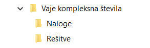

Uporaba
============

Program za generiranje nalog je sestavljen iz knjižnice nalog iz različnih področij srednješolske matematike in programa za sestavljanje testov.. Ko zaženemo program z željenimi parametri nam ustvari testov in rešitve v `PDF` in `LaTeX` obliki.

********
Naloge
********
Vsebuje 60 takih nalog iz teh področij

**************
Izpis testov
**************
Za izpis testov je potrebno poklicati funkcijo ``sestavi_vse_teste`` iz programa ``izpisi_naloge.py``. Funkcija sprejme štiri parametre:

#. seznam nalog
#. ime testa
#. datoteko, ki vsebuje seznam dijakov
#. izbira združenih ali ločenih rešitev

in ustvari teste ter rešitve. Poleg končnega dokumenta v `PDF` formatu, imamo vedno še original `LaTeX` dokument.
Slednji je na voljo, če želimo naknadni kaj sprementiti v testu.

.. TODO: autorun požene na licu mesta conf.py in ne tm k program dejansko je, zato je treba mal okol kodo napisat (recimo datoteko za dijake kliče drugače). Ne prenese šumnikov (niti v nizu). pazi na presledek # ignore

.. runblock:: pycon

    >>> import sys # ignore
    >>> sys.path.append('../') # ignore
    >>> from izpisi_naloge import * # ignore
    >>> sestavi_vse_teste(naloge=[izrazi.PotencaDvoclenika(st_nalog=3), izrazi.RazstaviRazliko(min_potenca=3), naravna_stevila.DeliteljVeckratnik()], ime_testa='Izrazi in deljivost', datoteka_seznam_dijakov='../dijaki.txt', zdruzene_resitve=False)

Program ustvari mapo z enakim imenom kot ime testa in 2 podmapi:

#. Naloge
#. Rešitve

    Ustvarjeni mapi za teste in rešitve testov

Mapa `Naloge` vsebuje posamezne zgenerirane teste, mapa `Rešitve` pa rešitve zgeneriranih testov.

Seznam nalog
#############

Parameter ``naloge`` je seznam nalog iz knjižnice, ki jih želimo na posameznem testu. Na seznamu lahko podamo poljubno število nalog.

``naloge=[izrazi.PotencaDvoclenika(st_nalog=3),izrazi.RazstaviRazliko(min_potenca=3),naravna_stevila.DeliteljVeckratnik()]``

Knjižnica vsebuje naloge iz različnih področij, ki pa lahko imajo enaka imena. Zato moramo vedno nalogo klicati tako, da najprej napišemo ime poglavja in nato ime naloge. Naloge imajo različne parametre, ki so pojasnjeni v #TODOsklic točki.

``ime_poglavja.ime_naloge(parametri)``.

Primeri:

``kvadratna_funkcija.Neenacba(st_nalog=3)``

``linearna_funkcija.Neenacba()``

Ime testa
############
Parameter ``ime_testa`` je niz željenega imena testa. Izbrano ime je lahko poljubno in lahko vsebuje tudi presledke, šumnike in druge znake. Ime testa se izpiše na vrhu posameznega testa in rešitev. Enako ime ima tudi na novo ustvarjena mapa, ki vsebuje teste in rešitve.
Če imena testa ne podamo, se namesto njega izpiše današnji datum.

Primer:

``ime_testa='Kvadratna funkcija'``

Seznam dijakov
################
Seznam dijakov napišemo v ločeni tekstovni datoteki (`.txt`), tako da so podatki posameznega dijaka v svoji vrstici.
Podatki dijaka so lahko poljubni: ime, priimek, vpisna številka,... Namesto podatkov dijakov lahko podamo tudi naprimer imena skupin: A in B.
Podatek v posamezni vrstici predstavlja podnaslov našega testa in ime datotetke posameznega testa ali rešitve.

.. figure:: slike/dijaki.png
    :align: center

    Primer tekstovne datotetke

.. figure:: slike/testi.png
    :align: center

    Primer mape z generirami testi.

Če datotetka s seznamom ni podana, bo program ustvaril samo 1 test s privzetim podnaslovom `Matematika`.

Semena
********
Vrednosti v posameznih nalogah so psevdo-naključno generirana. Za seme posameznega testa je uporabljen podnaslov testa.
To nam zagotavlja, da bomo za posameznega dijaka oziroma skupino vedno dobili nalogo z enakimi podatki, ne glede na to kolikokrat zaženemo program.
Na tak način zagotovimo, da če nam je posamezna naloga všeč, se s popravljanjem drugih ne bo spremenila. Vendar se moramo zavedati, da na naključno generirane številke vpliva tudi vrstni red posameznih nalog.

Združene rešitve
##################
Rešitve nalog so lahko samostojna datoteka za vsakega dijaka ali pa so vse združene v eno datoteko. Privzete so združene rešitve.
Če želimo ločene moramo izbrati: ``zdruzene_resitve=False``.

***********************
Spreminjanje parametrov
***********************
Naloge imajo različne parametre s katerimi lahko malo prilagajamo zahtevnost naloge, kompleksnost rešitev ali tip naloge.

Parameter število nalog
########################
Vse naloge imajo parameter `število nalog`(``st_nalog``), s katerim določamo koliko primerov posamezne naloge želimo imeti.
Privzeta vrednost je en primer. Če želimo več primerov pa moramo podati naravno številsko vrednost koliko primerov želimo.

Naslednja koda, bi ustvarila test, z dvema enakima nalogama. Prva naloga ima samo 1 primer računa, druga naloga pa 5 primerov (glej sliko).

>>>sestavi_vse_teste([kompleksna_stevila.Mnozenje(), kompleksna_stevila.Mnozenje(st_nalog=5)])

.. figure:: slike/st_nalog.png
    :align: center

    Izpis naloge z enim primerom in s 5 primeri.

Specifični/dodatni parametri
##############################
Ostali parametri so specifični za vsako nalogo.

Pri nalogi `DeliteljVeckratnik` mora dijak izračunati najmanjši skupni večkratnik in največji skupni delitelj dveh števil.
S parametrim ``do`` lahko določamo kako veliki sta lahko števili. Privzeta vrednost so števila do 200.
S parametrom ``najvecje_prastevilo`` pa določimo kaj je navečje praštevilo, ki se lahko pojavi v praštevilskem razcepu števil. Privzeta vrednost je 17.

.. literalinclude:: ..\..\naravna_stevila.py
   :pyobject: DeliteljVeckratnik

***********************
Predloge
***********************

Vsaka naloga ima predloge za:

* besedilo naloge z enim primerom ``besedilo_posamezne``
* besedilo naloge z večimi primeri ``besedilo_vecih``
* besedilo rešitve naloge z enim primerom ``resitev_posamezne``
* besedilo rešitve naloge z večimi rešitvami ``resitev_vecih``

Besedila so nizi, ki se pretvorijo v predloge Python knjižnice Jinja2 (``Jinja2.Template``).
V predlogo se na mesta spremenljivk označenih z dvojnimi zaviti oklepaji kasneje vstavijo posamezne vrednosti naloge.

.. literalinclude:: ..\..\naravna_stevila.py
   :pyobject: DeliteljVeckratnik
   :lines: 16

Metoda ``_poskusi_sestaviti`` vrne slovar vrednosti, ki se vstavijo na mankajoča mesta v predlogo.
Ključi v slovarju, se morajo ujemati z imeni spremenljivk v predlogi.

.. literalinclude:: ..\..\naravna_stevila.py
   :pyobject: DeliteljVeckratnik._poskusi_sestaviti

