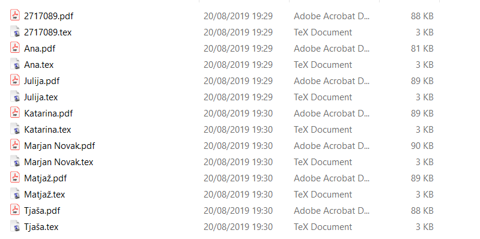

.. _ref_uporaba:

Uporaba
============

Program za generiranje nalog je sestavljen iz knjižnice nalog iz različnih področij srednješolske matematike in programa
za sestavljanje testov. Ko zaženemo program z želenimi parametri nam ustvari teste in rešitve v `LaTeX` datotekah ter po
želji tudi v `PDF` datotekah.

********
Naloge
********
Vsebuje 60 takih nalog iz teh področij
.. todo katere naloge

**************
Izpis testov
**************
Za izpis testov je potrebno poklicati funkcijo ``sestavi_vse_teste`` iz datoteke ``generiranje.py``. Funkcija sprejme
osem parametrov:

#. seznam nalog
#. ime testa
#. datoteko, ki vsebuje seznam učencev
#. izbira združenih ali ločenih rešitev
#. izbira za avtomatično generiranje PDF datotek
#. kateri vzorec za test želimo uporabiti
#. kateri vzorec za rešitve želimo uporabiti
#. seznam možnih točk pri posamezni nalogi

in ustvari teste ter rešitve kot `LaTeX` dokumente. Če želimo lahko avtomatično ustvari dokumente tudi v `PDF` formatu.
`LaTeX` dokument je na voljo zato, da vedno lahko kaj naknadno spremenimo ali popravimo.

.. code-block:: python

    >>> generiranje.sestavi_vse_teste(naloge=[izrazi.PotencaDvoclenika(st_nalog=3), izrazi.RazstaviRazliko(min_potenca=3), naravna_stevila.DeliteljVeckratnik()], ime_testa='Izrazi in deljivost', datoteka_seznam_ucencev="ucenci.txt", zdruzene_resitve=False, pdf=True, pot_vzorca_testa="vzorci/vzorec_testa2.tex", pot_vzorca_resitev="vzorci/vzorec_posameznih_resitev1.tex", tocke=[5,5,7])
    Sestavljam test Izrazi in deljivost.
    Izpisujem test: 2717089
    Izpisujem rešitve: 2717089
    Izpisujem test: Ana
    Izpisujem rešitve: Ana
    Izpisujem test: Julija
    Izpisujem rešitve: Julija
    Izpisujem test: Katarina
    Izpisujem rešitve: Katarina
    Izpisujem test: Marjan Novak
    Izpisujem rešitve: Marjan Novak
    Izpisujem test: Matjaž
    Izpisujem rešitve: Matjaž
    Izpisujem test: Tjaša
    Izpisujem rešitve: Tjaša
    Test Izrazi in deljivost je sestavljen.

Program ustvari mapo z enakim imenom kot ime testa in 2 podmapi:

#. Naloge
#. Rešitve

.. figure:: slike/mape.png
    :align: center

    Ustvarjeni mapi za teste in rešitve testov

Mapa `Naloge` vsebuje posamezne zgenerirane teste, mapa `Rešitve` pa rešitve zgeneriranih testov.

Spodaj so prikazane prve strani treh testov. Primere testov si lahko v celoti ogledate v prilogi.
.. todo ref na prilogo

.. figure:: slike/test1.png
    :align: center
    :width: 30%
.. figure:: slike/test2.png
    :align: center
    :width: 30%
.. figure:: slike/test3.png
    :align: center
    :width: 30%

    Primeri prvih strani testov

Na slikah se vidi, kako izgledajo rešitve različnih učencev. V celoti so prav tako dostopni v prilogi.
.. todo ref na prilog

.. figure:: slike/resitve1.png
    :align: center
    :width: 30%
.. figure:: slike/resitve2.png
    :align: center
    :width: 30%
.. figure:: slike/resitve3.png
    :align: center
    :width: 30%

    Primeri rešitev

Kadar mapa z enakim imenom že obstaja, nas program vpraša, če jo želimo prepisati. Če izberemo možnost `da`, se stara mapa izbriše in ustvari nova.
Če izberemo možnost `ne`, stara mapa ostane nespremenjena hkrati pa se ustvari nova mapa z enakim imenom kot ime testa in uro ustvarjanja testa.

.. code-block:: python
    :emphasize-lines: 3,4, 13

    >>> generiranje.sestavi_vse_teste(naloge=[izrazi.PotencaDvoclenika(st_nalog=3), izrazi.RazstaviRazliko(min_potenca=3), naravna_stevila.DeliteljVeckratnik()], ime_testa='Izrazi in deljivost', datoteka_seznam_ucencev="ucenci.txt", zdruzene_resitve=True, pdf=False, tocke=[5,5,7])
    Sestavljam test Izrazi in deljivost.
    Mapa z imenom Izrazi in deljivost že obstaja.
    Ali jo želite prepisati z novo vsebino? [da/NE]>? ne
    Izpisujem test: 2717089
    Izpisujem test: Ana
    Izpisujem test: Julija
    Izpisujem test: Katarina
    Izpisujem test: Marjan Novak
    Izpisujem test: Matjaž
    Izpisujem test: Tjaša
    Izpisujem skupne rešitve za test Izrazi in deljivost.
    Test Izrazi in deljivost-02-13-50 je sestavljen.

Seznam nalog
#############

Parameter ``naloge`` je seznam nalog iz knjižnice, ki jih želimo na posameznem testu. Na seznamu lahko podamo poljubno
število nalog, ne sme pa biti prazen.

``naloge=[izrazi.PotencaDvoclenika(st_nalog=3),izrazi.RazstaviRazliko(min_potenca=3),naravna_stevila.DeliteljVeckratnik()]``

.. todo popravi naslednji stavek da bo jasno da so naloge isto poimenovane in ne področja

Knjižnica vsebuje naloge z različnih področij. Naloge iz različnih področij imajo lahko enaka imena,
zato moramo vedno nalogo klicati tako, da najprej napišemo ime poglavja in nato ime naloge. Naloge imajo različne
parametre, ki so pojasnjeni v razdelku :ref:'parametri'.

``ime_poglavja.ime_naloge(parametri)``.

Primeri:

``kvadratna_funkcija.Neenacba(st_nalog=3)``

``linearna_funkcija.Neenacba()``

Ime testa
############
Parameter ``ime_testa`` je niz željenega imena testa. Izbrano ime je lahko poljubno in lahko vsebuje tudi presledke,
šumnike in druge znake. Ime testa se izpiše na vrhu posameznega testa in rešitev. Enako ime ima tudi na novo ustvarjena
mapa, ki vsebuje teste in rešitve. Če imena testa ne podamo, se namesto njega izpiše današnji datum.

Primer:

``ime_testa='Izrazi in deljivost'``

.. TODO ali želim tudi tukaj ponoviti kaj se zgodi če ime že obstaja

Seznam učencev
################
Seznam učencev napišemo v ločeni tekstovni datoteki (`.txt`), tako da so podatki posameznega učenca v svoji vrstici.
Podatki učenca so lahko poljubni: ime, priimek, vpisna številka... Namesto podatkov učencev lahko podamo tudi naprimer imena skupin: A in B.
Podatek v posamezni vrstici predstavlja podnaslov našega testa in ime datoteke posameznega testa ali rešitve.

.. figure:: slike/ucenci.png
    :align: center

    Primer tekstovne datotetke

    Primer mape z generiranimi testi.

Če datoteka s seznamom ni podana, bo program ustvaril samo 1 test s privzetim podnaslovom `Matematika`.

.. _ref-semena:

Semena
********
Vrednosti v posameznih nalogah so psevdo-naključno generirane. Za seme posameznega testa je uporabljen podnaslov testa,
ki ga običajno predstavlja ime učenca ali skupine. To nam zagotavlja, da bomo za posameznega učenca oziroma skupino
vedno dobili nalogo z enakimi podatki, ne glede na to, kolikokrat zaženemo program.
Na tak način zagotovimo, da če nam je posamezna naloga všeč, se s popravljanjem drugih ne bo spremenila.
Vendar se moramo zavedati, da na naključno generirane številke vpliva tudi vrstni red posameznih nalog.

Združene rešitve
##################
Rešitve nalog so lahko samostojna datoteka za vsakega učenca ali pa so vse združene v eno datoteko. Privzete so združene rešitve.
Če želimo ločene moramo izbrati: ``zdruzene_resitve=False``.

PDF datoteke
#############
Testi in rešitve so `LaTeX` dokumenti, zato da imamo možnost spreminjanja in popravljanja. Ker pa za končno uporabo običajno
potrebujemo `PDF` datoteke, nam jih lahko program avtomatično ustvari. Privzeto je ustvarjanje `PDF` datotek, vendar to
poveča časovno zahtevnost programa. Če ne želimo avtomatično generiranih `PDF` datotek, moramo nastaviti ``pdf=False``.

.. code-block:: python

    >>> generiranje.sestavi_vse_teste(
        naloge=[izrazi.PotencaDvoclenika(st_nalog=3),izrazi.RazstaviRazliko(min_potenca=3),
        naravna_stevila.DeliteljVeckratnik()],
        ime_testa='Izrazi in deljivost',
        zdruzene_resitve=True)
    Sestavljam test Izrazi in deljivost.
    Izpisujem test: Matematika
    Izpisujem skupne rešitve za test Izrazi in deljivost.
    Test Izrazi in deljivost je sestavljen.

.. _ref-parametri:

Vzorci testov
##############
V mapi `vzorci` so štirje različne predloge oziroma vzorci testov. Uporabnik se odloči, kateri je najprimernejši zanj in nastavi
spremenljivko `pot_vzorca_testa` kot niz, do željenege predloge. Privzeta je predloga `vzorec_testa1.tex`.

Primer: ``pot_vzorca_testa=vzorci/vzorec_testa2.tex``

Predloga `vzorec_testa1.tex` je verjetno najprimernejša za utrjevanje znanja. Na vrhu je napisano ime testa, pod njim
podnaslov, ki ga razbere iz seznama učencev. Nato so brez večjih razmakov naštete vse naloge.

.. figure:: slike/vzorec_testa1.png
    :align: center

    Primer testa sestavljenega iz `vzorec_testa1.tex`

Predlogi `vzorec_testa2.tex` in `vzorec_testa3.tex` sta primernejši za kontrolne naloge. Imata prostor za podpis učenca,
ime testa, podnaslov in kriterij ocenjevanja. Če želimo da je pod nalogo prostor za reševanje, je bolj primeren vzorec
`vzorec_testa2.tex`.

.. figure:: slike/vzorec_testa2.png
    :align: center

    Primer testa sestavljenega iz `vzorec_testa2.tex`

Če uporabimo predlogo `vzorec_testa3.tex`, so vse naloge naštete na eni strani.

.. figure:: slike/vzorec_testa3.png
    :align: center

    Primer testa sestavljenega iz `vzorec_testa3.tex`

Predloga `vzorec_testa4.tex` pa je bolj primerna za popravne izpite, saj ima nalovna stran veliko postora za
natačno podane zahteve znanja in jasno zapisan kriterij. Vsaka naloga je na svoji strani, tako da imajo učenci dovolj
prostora za reševanje na test.

.. figure:: slike/vzorec_testa4.png
    :align: center

    Primer testa sestavljenega iz `vzorec_testa4.tex`

Vzorci rešitev
###############
V mapi `vzorci` so tudi predloge oziroma vzorci za rešitve. Pozorni moramo biti, ali smo se odločili za združene
rešitve ali ne, saj se predloge za njih razlikujejo.

Združene rešitve
*****************
V primeru združenih rešitev, program sestavi samo eno datoteko z vsemi rešitvami. Privzeta nastavitev je predloga
`vzorec_skupnih_resitev1.tex`. Za vsakega učenca se rešitve začnejo na novi strani in ima naštete samo rešitve.

.. figure:: slike/vzorec_skupne1.png
    :align: center

    Primer rešitev sestavljenih iz `vzorec_skupnih_resitev1.tex`

Predloga `vzorec_skupnih_resitev2.tex` ji je zelo podobna, le da se rešitve naslednjega učenca ne začnejo na novi strani.

.. figure:: slike/vzorec_skupne2.png
    :align: center

    Primer rešitev sestavljenih iz `vzorec_skupnih_resitev2.tex`

Če uporabimo predlogo `vzorec_skupnih_resitev3.tex` pa imamo najprej zapisano nalogo in šele nato rešitev.

.. figure:: slike/vzorec_skupne3.png
    :align: center

    Primer rešitev sestavljenih iz `vzorec_skupnih_resitev3.tex`

Posamezne rešitve
*******************
Privzeta predloga za posamezne rešitve je `vzorec_posameznih_resitev1.tex`. Na vrhu je naslov, nato pa so
zaporedno naštete vse rešitve.

.. figure:: slike/vzorec_posamezne1.png
    :align: center

    Primer rešitev sestavljenih iz `vzorec_posameznih_resitev1.tex`

Če želimo, da imamo najprej zapisane naloge in nato rešitve, moramo izbrati predlogo `vzorec_posameznih_resitev2.tex`.

.. figure:: slike/vzorec_posamezne2.png
    :align: center

    Primer rešitev sestavljenih iz `vzorec_posameznih_resitev2.tex`

Včasih želimo učencem dati rešitve za samostojno preverjanje, vendar nočemo da se rešitve razberejo že ob prvem pogledu.
Zato ima predloga `vzorec_posameznih_resitev3.tex` zelo majhno pisavo za katero se moramo potruditi, da jo lahko razberemo.

.. figure:: slike/vzorec_posamezne3.png
    :align: center

    Primer rešitev sestavljenih iz `vzorec_posameznih_resitev3.tex`

Točke
######
Na kontrolnih nalogah mora biti jasno zapisano, koliko točk je vredna posamezna naloga. Če želimo, da se vrednosti
avtomatično izpišejo zraven posamezne naloge oziroma rešitev, moramo kot parameter `tocke` podati seznam možnih točk.
Privzeta vrednost je prazen seznam - v tem primeru je namesto točk le prazen prostor.
Pri podajanju parametra je pomemben vrstni red, saj prva vrednost na seznamu predstavlja število možnih točk pri prvi
nalogi. Če naprimer podamo `tocke=[6,3,9]`, pomeni da je prva naloga vredna 6 točk, druga 3 točke, tretja pa 9 točk.

Pomembno je, da je seznam nalog `naloge` enako dolg kot seznam točk `tocke`. V nasprotnem primeru nas program na to
opozori.

Včasih lahko zahtevnost naloge določimo šele, ko vidimo dejanske vrednosti v nalogi in ne prej. V tem primeru najprej
zaženemo program brez podanega seznama točk in šele ko vemo koliko bodo posamezne naloge vredne, ponovno zaženemo
program s podanim parametrom `tocke`. Semena (glej :ref:'ref-semena'.) nam zagotavljajo, da bomo v obeh primerih dobili enake vrednosti.

***********************
Spreminjanje parametrov
***********************
Naloge imajo različne parametre. Vse naloge imajo parametre, ki določajo besedilo nalog in besedila rešitev ter koliko
primerov naj vsebuje posamezna naloga.
Nekatere pa imajo tudi dodatne parametre s katerimi lahko malo prilagajamo zahtevnost naloge, kompleksnost rešitev ali tip naloge.

Parametri za besedilo nalog in rešitev
########################################
Vsaka naloga ima 4 parametre, ki so predloge za:

* besedilo naloge z enim primerom ``besedilo_posamezne``
* besedilo naloge z večimi primeri ``besedilo_vecih``
* besedilo rešitve naloge z enim primerom ``resitev_posamezne``
* besedilo rešitve naloge z večimi rešitvami ``resitev_vecih``

Besedila so surovi nizi, ki se pretvorijo v predloge Python knjižnice Jinja2 (``Jinja2.Template``).
V predlogo se na mesta spremenljivk označenih z dvojnimi zaviti oklepaji kasneje vstavijo posamezne vrednosti naloge.

.. literalinclude:: ..\..\naravna_stevila.py
   :pyobject: DeliteljVeckratnik
   :lines: 16

Metoda ``_poskusi_sestaviti`` vrne slovar vrednosti, ki se vstavijo na manjkajoča mesta v predlogo.
Ključi v slovarju, se morajo ujemati z imeni spremenljivk v predlogi.

.. literalinclude:: ..\..\naravna_stevila.py
   :pyobject: DeliteljVeckratnik._poskusi_sestaviti

Parameter število nalog
########################
Prav tako ima vsaka naloga parameter `število nalog` (``st_nalog``) s katerim določamo koliko primerov posamezne naloge želimo imeti.
Privzeta vrednost je en primer. Če želimo več primerov pa moramo podati naravno številsko vrednost, koliko primerov želimo.

Naslednja koda, bi ustvarila test, z dvema enakima nalogama. Prva naloga ima samo 1 primer računa, druga naloga pa 5 primerov (glej sliko).

.. code-block:: python

    >>>sestavi_vse_teste([kompleksna_stevila.Mnozenje(), kompleksna_stevila.Mnozenje(st_nalog=5)])

    Izpis naloge z enim primerom in s 5 primeri.

Dodatni parametri
##############################
Ostali parametri so specifični za vsako nalogo. Z njimi lahko uravnavamo zahtevnost naloge ali kako lepe so številske
rešitve. Včasih pa je lahko zelo podobna naloga primerna za različne stopnje znanja in s parametri lahko določimo
na kateri stopnji znanja so učenci. Vsi podani parametri imajo podane privzete vrednosti, tako da jih ni potrebno
določati, če tega ne želimo.

V nadaljevanju bo predstavljenih nekaj zanimivih primerov nalog.

Pri nalogi ``DeliteljVeckratnik`` mora učenc izračunati najmanjši skupni večkratnik in največji skupni delitelj dveh števil.
S parametrim ``do`` lahko določamo kako veliki sta lahko števili in tako omejimo kako zahtevno bo računanje.
Privzeta vrednost so števila do 200. S parametrom ``najvecje_prastevilo`` pa določimo kaj je navečje praštevilo, ki se lahko pojavi v praštevilskem razcepu števil. Privzeta vrednost je 17.

.. literalinclude:: ..\..\naravna_stevila.py
   :pyobject: DeliteljVeckratnik

Naloga ``SistemDvehEnacb`` iz poglanja linearn funkcija ima lahko različno zahtevne številske rešitve. Običajno nam je
lažje izručunati celoštevilske rešitve. Če pa določimo parameter ``racionalne_resitve=True``, pa bo naloga bolj raznolika,
saj bodo lahko rešitve tako celoštevilske kot tudi racionalne. Na tak način lahko dosežemo tudi večjo raznolikost nalog.

.. literalinclude:: ..\..\linearna_funkcija.py
   :pyobject: SistemDvehEnacb

Podobno lahko tudi računanje prvih členov zaporedja naredimo malo računsko zahtevnejših, če lahko za prvi člen in
diferenco določimo racionalna števila namesto celih.

.. literalinclude:: ..\..\zaporedja.py
   :pyobject: PrviCleniAritmeticnega

Pri računanju ničel polinoma se zahtevnost hitro povečuje z višanjem stopnje polinoma. Zato je pomembno, da lahko
s parametroma ``min_stopnja``, ki določa najmanjšo možno stopnjo polinoma, in ``max_stopnja``, ki določa
najvišjo možno stopnjo polinoma, uravnavamo polinomom kakšnih stopenj bomo iskali ničle. Ker lahko določamo zgornjo
in spodnjo mejo stopenj, tako obstaja nek razpon stopenj, da so naloge lahko raznolike. S parametroma
``min_nicla`` in ``max_nicla`` pa lahko določimo s kako velikimi vrednostimi bomo računali.

.. literalinclude:: ..\..\polinomska_racionalna_funkcija.py
   :pyobject: NiclePolinoma

Zahtevnost naloge lahko spreminjamo tudi z zahtevnostjo predpisa. Pri zapisu elementov izpeljane množice
lahko podamo preprost predpis za :math:`n`
:math:`\{n ; 1 < n < 5\}` ali pa malo zahtevnejši z linearno kombinacijo :math:`\{ 3 \cdot n -2 ; 1 < n < 5\}`.
Ravno to spreminja parameter ``linearna_kombinacija`` naloge ``ElementiMnozice``.

.. literalinclude:: ..\..\mnozice.py
   :pyobject: ElementiMnozice

Težavnost naloge lahko povečamo, če uvedemo dodaten korak ali znanje, ki je potrebno za rešitev naloge.
Pri reševanju eksponentnih enačb, kjer nastopata dve različni osnovi, je pogosto potrebno samo izpostaviti
vsako osnovo na svoji strani in izenačiti eksponenta. Vendar pa lahko nalogo napišemo tako, da je vsaka osnova pomnožena
s potenco druge osnove. Tako moramo pri reševanju dodati še korak deljenja.

.. literalinclude:: ..\..\eksponentna_funkcija.py
   :pyobject: Enacba2osnovi

Reševanje enačb s kompleksnimi števili lahko naredimo bolj raznolike, če poleg neznanega števila :math:`z` nastopa
še njego konjugirana vrednost :math:`\overline{z}`. To lahko v nalogi ``Enacba`` določimo s parametrom
``konjugirana_vrednost``.

.. literalinclude:: ..\..\kompleksna_stevila.py
   :pyobject: Enacba

Včasih lahko podobne naloge rešujemo z različnimi stopnjami znanja, zato je potrebno nalogo prilagoditi trenutnemu
znanju učencev. V poglavju stožnic se pogosto najprej spozna enačbe v središčni legi, kasneje pa šele v premaknjeni legi.
Zato je smiselno, da lahko pri nalogi ``TemeGorisceEnacba``, kjer določamo teme in gorišča elipse, določimo s parametrom ``premaknjena``,
ki lego elipse.

.. literalinclude:: ..\..\stoznice.py
   :pyobject: TemeGorisceEnacba

V poglavju odvodi učenci postopoma spoznavajo odvode različnih funkcij. Nalogo ``OdvodSestavljene`` s parametrom
``funkcije`` lahko prilagodimo za primerno znanje, oziroma lahko določamo njeno zahtevnost. Izbiramo lahko med
eksponentnimi, logaritemskimi, racionalnimi, polinomskimi ali kotnimi funkcijami. Da program lahko ločuje,
med vrstami funkcijami so imena funkcij določena z razredom ``Funkcija``.

.. literalinclude:: ..\..\odvodi.py
   :pyobject: Funkcija

Funkcije, ki se lahko pojavijo v računu torej določimo s parametrom ``funkcije`` tako da jih naštejemo v seznamu.

Primer: ``funkcije=[Funkcija.KOTNA, Funkcija.LOGARITEM]``

.. literalinclude:: ..\..\odvodi.py
   :pyobject: OdvodSestavljene

Rešitvi kvadratne enačbe sta lahko kompleksni števili, vendar se lahko zgodi, da takih rešitev ne želimo ali
da snovi kompleksnih števil še nismo obravnavali. Zato lahko nalogi ``IzracunajNicle`` s parametrom
``kompleksni_nicli`` določimo ali želimo da sta rešitvi kompleksni ali realni števili.

.. literalinclude:: ..\..\kvadratna_funkcija.py
   :pyobject: IzracunajNicle

Pri računanju algebrajskih izrazov, je za na videz podobne naloge potrebno različno znanje. Naloga ``PotencirajVecclenik``
ima zato več parametrov. Parametra ``min_clenov`` in ``max_clenov`` določata ali v nalogi potenciramo dvočlenike,
tročlenike ali malo mešano.  Parametra ``min_potenca`` in ``mix_potenca`` pa določata razpon potenc.
Na ta način lahko dobimo raznolike primere enega tipa naloge.

.. literalinclude:: ..\..\izrazi.py
   :pyobject: PotencirajVecclenik

